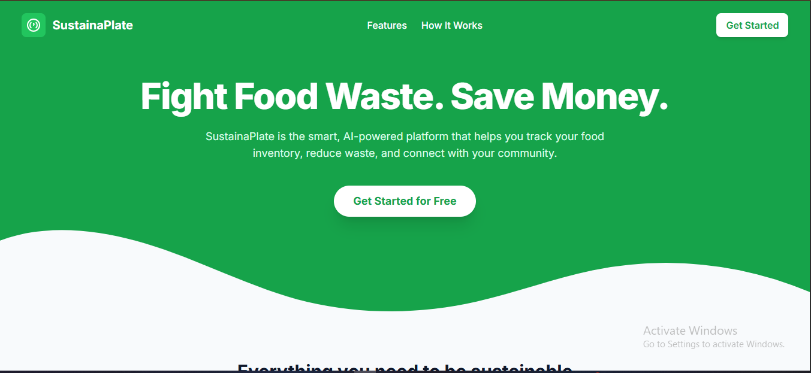
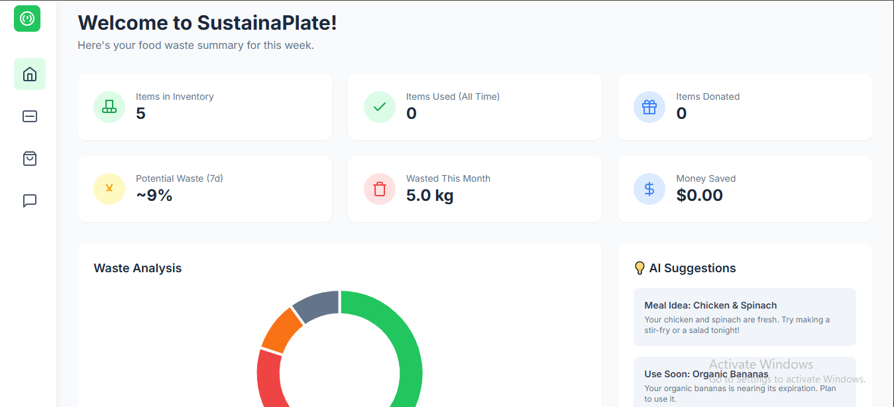
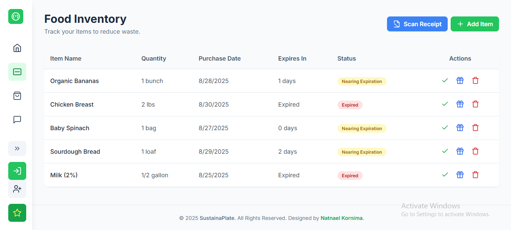
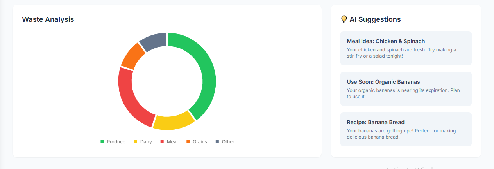
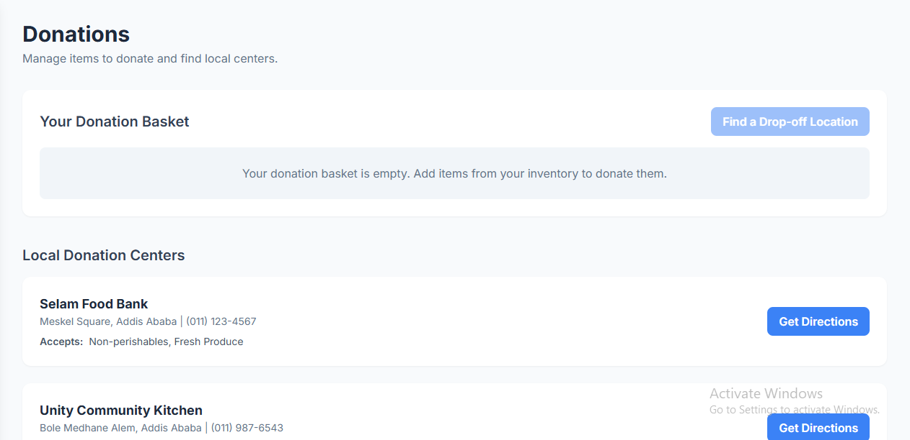

# SustainaPlate

SustainaPlate is an innovative, AI-powered web platform designed to combat food waste by helping users manage their food inventory, reduce waste, and connect with their community. Whether you're an individual looking to optimize your kitchen or a restaurant aiming to minimize waste, SustainaPlate provides tools like AI-driven inventory tracking, waste analytics, a community marketplace, and easy donation options to make sustainability accessible and impactful.

## Table of Contents

- [Features](#features)
- [Getting Started](#getting-started)
- [Usage](#usage)
- [Screenshots](#screenshots)
- [Demo Video](#demo-video)
- [Installation](#installation)
- [Technologies Used](#technologies-used)
- [Contributing](#contributing)
- [License](#license)
- [Contact](#contact)

## Features

- **AI-Powered Inventory**: Scan grocery receipts to automatically add items to your inventory. The AI predicts spoilage dates and suggests recipes to prioritize food usage.
- **Waste Analytics**: Visualize waste patterns with interactive charts and receive AI-driven suggestions to reduce waste.
- **Community Marketplace**: Share surplus food with neighbors to prevent waste and foster community connections.
- **Easy Donations**: Find and get directions to local food banks and charities for seamless donations.
- **Premium Features**: Upgrade to access advanced AI insights, detailed analytics for businesses, and an ad-free experience.

## Getting Started

To start using SustainaPlate:

1. Visit the SustainaPlate website and create a free account.
2. Log your food by scanning receipts or manually adding items.
3. Explore insights, share surplus food, or donate to local charities.

No installation is required for the web application. For developers interested in contributing or running locally, see the [Installation](#installation) section.

## Usage

1. **Log Your Food**: Upload a grocery receipt or manually enter items into your inventory.
2. **Get Insights**: View AI-generated predictions on spoilage dates and recipe suggestions.
3. **Take Action**: Use food before it spoils, share extras on the Community Marketplace, or donate to nearby food banks.
4. **Go Premium**: Upgrade for advanced analytics and insights tailored for restaurants or heavy users.

The dashboard provides a centralized hub for managing your inventory, marketplace activities, donations, and settings.

## Screenshots

Below are key screenshots showcasing SustainaPlate's features:

### Landing Page
*The main landing page introducing SustainaPlate's mission and features.*



### Dashboard
*The user dashboard displaying inventory, waste analytics, and community options.*



### Inventory Management
*Easily track and manage food items with AI-powered spoilage predictions.*



### Community Marketplace
*Share surplus food with neighbors to reduce waste.*


### Waste Analytics
*Visualize waste patterns with interactive charts and AI-driven insights.*



### Donation Centers
*Find and get directions to local food banks and charities.*



## Demo Video

Watch a quick overview of SustainaPlate in action:

[](https://www.youtube.com/watch?v=YOUR_VIDEO_ID)

*Click the thumbnail to watch the demo video on YouTube.*

## Installation

To run SustainaPlate locally for development or testing:

1. **Clone the Repository**:
   ```bash
   git clone https://github.com/sustainaplate/sustainaplate.git
   cd sustainaplate
   ```

2. **Install Dependencies**:
   Ensure you have Node.js installed, then run:
   ```bash
   npm install
   ```

3. **Run the Application**:
   Start the development server:
   ```bash
   npm start
   ```

4. **Access the App**:
   Open `http://localhost:3000` in your browser to view the application.

**Note**: Ensure you have a backend server and API keys configured for AI features and map integrations (e.g., Google Maps API).

## Technologies Used

- **Frontend**: HTML, CSS, JavaScript
- **Backend**: Node.js (assumed, adjust based on your stack)
- **AI**: Custom AI models for inventory tracking and spoilage prediction
- **APIs**: Google Maps API for donation center directions
- **Styling**: Tailwind CSS (assumed for modern, responsive design)
- **Database**: (Specify if applicable, e.g., MongoDB, Firebase)
- **Other**: (Add additional tools or libraries as needed)

## Contributing

We welcome contributions to make SustainaPlate even better! To contribute:

1. Fork the repository.
2. Create a new branch (`git checkout -b feature/your-feature`).
3. Make your changes and commit (`git commit -m "Add your feature"`).
4. Push to the branch (`git push origin feature/your-feature`).
5. Open a pull request with a detailed description of your changes.

Please follow our Code of Conduct and ensure all tests pass before submitting.

## License

This project is licensed under the MIT License. See the [LICENSE](LICENSE) file for details.

## Contact

For questions or support, reach out to:

- **Email**: support@sustainaplate.com
- **Website**: [sustainaplate.com](https://sustainaplate.com)
- **Designer**: Natnael Kornima

---

Join the SustainaPlate community and start reducing food waste today! 🌱
